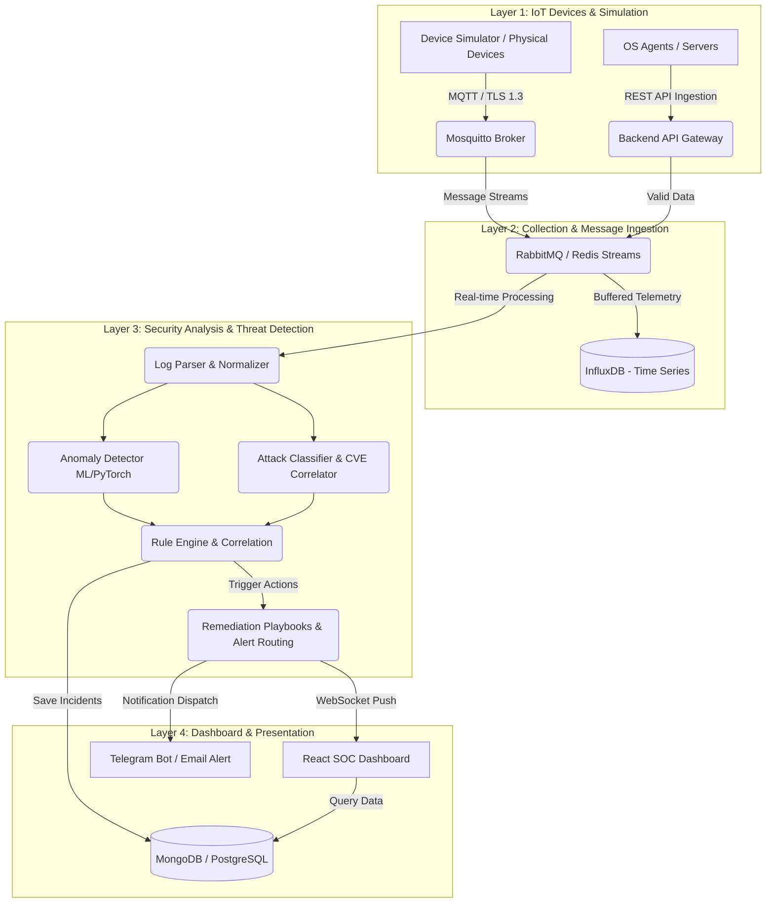

# WORKFLOW PHÁT TRIỂN DỰ ÁN: ICS-GUARD
## Hệ thống Giám sát & Bảo vệ Hạ tầng IoT Quan trọng khỏi Tấn công Mạng theo Thời gian Thực

Tài liệu này hệ thống hóa toàn bộ lộ trình triển khai, kiểm thử, phân chia công việc và nghiệm thu dự án **ICS-Guard** dựa trên tài liệu Hướng dẫn Đồ án Tốt nghiệp (BTEC FPT 2026).

---

## 1. KIẾN TRÚC HỆ THỐNG 4 LỚP (ARCHITECTURAL OVERVIEW)

Workflow được xây dựng xung quanh luồng dữ liệu 4 lớp chạy liên tục theo thời gian thực:

---

## 2. LỘ TRÌNH TRIỂN KHAI CHI TIẾT (DEVELOPMENT ROADMAP)

Dự án được chia làm **6 giai đoạn** cuốn chiếu, đảm bảo tính liên tục của dữ liệu đầu vào.

### GIAI ĐOẠN 1: THIẾT LẬP HẠ TẦNG & PHÁT TRIỂN SIMULATOR
*Mục tiêu: Xây dựng môi trường Docker tập trung và tạo dữ liệu kiểm thử.*

- [ ] **1.1. Cấu hình Docker Compose nền tảng:**
  - Khởi chạy các container: Eclipse Mosquitto, InfluxDB, PostgreSQL, Redis/RabbitMQ.
  - Thiết lập mạng nội bộ Docker (bridge network) và volume lưu trữ dữ liệu bền vững.
- [ ] **1.2. Phát triển Device Simulator (Python):**
  - Giả lập tối thiểu 3 loại thiết bị: PLC (nhà máy), Smart Meter (điện lực), Sensor (nhiệt độ/áp suất).
  - Tích hợp thư viện `paho-mqtt` hỗ trợ gửi telemetry định kỳ.
  - Lập trình kịch bản giả lập tấn công:
    - **Brute Force:** Gửi liên tục các gói tin xác thực lỗi (`AUTH_FAILED`).
    - **Traffic Spike:** Đột biến lưu lượng gửi lên gấp 8 lần bình thường.
    - **Port Scan/Anomaly:** Telemetry chứa payload bất thường (ngoài ngưỡng hoạt động an toàn).

### GIAI ĐOẠN 2: THU THẬP & LƯU TRỮ DỮ LIỆU (INGESTION PIPELINE)
*Mục tiêu: Đảm bảo dữ liệu được nhận và lưu trữ an toàn.*

- [ ] **2.1. Cấu hình bảo mật MQTT Broker:**
  - Cấu hình TLS 1.3 cho Mosquitto Broker để mã hóa kênh truyền.
  - Cấu hình xác thực Client qua username/password hoặc TLS Client Certificate.
- [ ] **2.2. Xây dựng REST API Ingestion:**
  - Tạo endpoint nhận logs thô dạng REST API (dành cho Windows/Linux agent) bảo mật bằng API Key hoặc JWT.
- [ ] **2.3. Xây dựng dịch vụ Data Ingestion Worker:**
  - Viết Worker lắng nghe MQTT và REST API.
  - **Data Validation:** Xác thực JSON Schema, chống replay attack bằng timestamp validation.
  - Lưu telemetry hợp lệ vào InfluxDB (thiết lập retention policy tự động dọn dẹp dữ liệu cũ).
  - Đẩy các bản tin cần phân tích bảo mật vào Message Queue (RabbitMQ/Redis).

### GIAI ĐOẠN 3: PHÂN TÍCH & PHÁT HIỆN MỐI ĐE DỌA (CORE ANALYSIS)
*Mục tiêu: Phát hiện bất thường và phân loại hành vi tấn công.*

- [ ] **3.1. Phát triển Log Parser & Normalizer:**
  - Nhận log từ queue, chuẩn hóa các định dạng thô (Syslog, JSON, CSV) về cấu trúc chung của hệ thống.
- [ ] **3.2. Phát triển Anomaly Detector (ML Engine):**
  - Huấn luyện mô hình phát hiện bất thường đơn giản bằng Scikit-Learn hoặc PyTorch (mục tiêu F1-score > 0.8 trên tập test).
  - Gắn nhãn trạng thái thiết bị theo độ lệch chuẩn hoặc mô hình học máy.
- [ ] **3.3. Phát triển Attack Classifier & CVE Correlator:**
  - Phân loại tấn công dựa trên đặc trưng hành vi (DDoS, Brute Force, Port Scan).
  - Tích hợp thư viện đối chiếu phiên bản thiết bị với cơ sở dữ liệu CVE/NVD để tính điểm rủi ro (Risk Scoring).

### GIAI ĐOẠN 4: HỆ THỐNG QUY TẮC & TỰ ĐỘNG PHẢN ỨNG (RULE ENGINE)
*Mục tiêu: Ra quyết định xử lý tự động khi phát hiện tấn công.*

- [ ] **4.1. Phát triển Rule Engine & Rule Builder:**
  - Xây dựng API và giao diện cho phép Analyst tạo rule động: `Field` (ví dụ `eventType`) + `Operator` (ví dụ `=`) + `Threshold` (`AUTH_FAILED > 10`) + `Time Window` (`2 phút`).
  - Viết bộ máy xử lý Correlation Engine để gom nhóm và đối chiếu sự kiện theo thời gian thực.
- [ ] **4.2. Xây dựng cơ chế Auto-Response:**
  - **Auto Block IP:** Gọi API Firewall giả lập để thêm IP tấn công vào danh sách chặn.
  - **Device Isolation:** Quá cảnh cô lập thiết bị nhiễm độc ra khỏi phân vùng mạng (Zone an toàn).
  - **Playbook Engine:** Thực thi chuỗi hành động cấu hình sẵn (ví dụ: vừa block IP, vừa gửi Telegram, vừa ghi log sự cố).

### GIAI ĐOẠN 5: DASHBOARD GIÁM SÁT & CẢNH BÁO ĐA KÊNH
*Mục tiêu: Trực quan hóa thông tin vận hành và tương tác thời gian thực.*

- [ ] **5.1. Xây dựng Real-time Push (WebSocket):**
  - Tích hợp Socket.io hoặc WebSocket truyền sự kiện tức thời từ backend lên dashboard.
- [ ] **5.2. Phát triển Frontend Dashboard (React + Tailwind + D3/Recharts):**
  - **Network Topology Map:** Bản đồ thiết bị theo Zone, đổi màu thiết bị (Xanh: An toàn | Vàng: Cảnh báo | Đỏ: Nguy hiểm).
  - **KPI Metrics:** Tổng sự kiện, cảnh báo, thiết bị online, chỉ số MTTD, MTTR.
  - **Threat Heatmap:** Hiển thị mật độ tấn công theo vị trí và thời gian.
  - **Alert Feed & Incident Timeline:** Danh sách cảnh báo thời gian thực có bộ lọc nâng cao và lịch sử diễn biến chi tiết.
- [ ] **5.3. Phát triển Notification Dispatcher (Module 6):**
  - Tích hợp gửi thông báo qua Email (SMTP).
  - Tích hợp Telegram Bot gửi cảnh báo tức thì kèm nút tương tác (Ví dụ: [Xác nhận sự cố] / [Hủy chặn IP]).
  - Phân luồng cảnh báo (Severity Routing): Info/Medium -> Email; High/Critical -> Telegram.

### GIAI ĐOẠN 6: AI ASSISTANT & HOÀN THIỆN ĐỒ ÁN
*Mục tiêu: Đạt điểm tối đa (Mức Xuất sắc) và chuẩn bị nghiệm thu.*

- [ ] **6.1. Tích hợp AI Security Assistant (Khuyến khích - Module 7):**
  - Kết nối OpenAI API, Claude API hoặc mô hình Ollama chạy cục bộ (DeepSeek-R1/Llama-3).
  - Chức năng: Giải thích ý nghĩa log thô, suy luận chuỗi tấn công (MITRE ATT&CK), đề xuất phương án khắc phục sự cố (Remediation).
  - Tự động tạo báo cáo sự cố PDF chuyên nghiệp.
- [ ] **6.2. Kiểm thử kịch bản & Viết tài liệu đầu ra:**
  - Viết Unit Test và Integration Test đạt tối thiểu 60% code coverage.
  - Biên soạn tài liệu hướng dẫn vận hành bằng Docker Compose.
  - Viết tài liệu Báo cáo Đồ án tốt nghiệp (>40 trang), Slide thuyết trình, quay video demo dài 5-10 phút.

---

## 3. CÔNG NGHỆ ÁP DỤNG & PHÂN CHIA VAI TRÒ

| Thành phần | Công nghệ Đề xuất | Ghi chú |
| :--- | :--- | :--- |
| **IoT Protocol** | MQTT (Eclipse Mosquitto) | TLS 1.3, QoS 1/2, authentication |
| **Backend API** | FastAPI (Python) hoặc NestJS | Xử lý bất đồng bộ (async), tích hợp ML |
| **Time-series DB** | InfluxDB | Lưu trữ telemetry thiết bị |
| **Event / Meta DB** | PostgreSQL hoặc MongoDB | Lưu thông tin cấu hình, người dùng, sự cố |
| **Message Queue** | RabbitMQ hoặc Redis Streams | Điều phối tải và tách biệt dịch vụ |
| **Frontend** | ReactJS + D3.js / Recharts | Dashboard hiển thị topo và biểu đồ |
| **Real-time Push** | WebSocket / Socket.io | Đẩy sự kiện lên dashboard lập tức |
| **AI/ML Engine** | PyTorch / Scikit-learn / Ollama | Phát hiện bất thường & Trợ lý bảo mật |
| **Deployment** | Docker & Docker Compose | Đóng gói toàn bộ hệ thống bằng 1 lệnh |

---

## 4. KỊCH BẢN KIỂM THỬ DEMO BẮT BUỘC

Hệ thống phải vượt qua 3 kịch bản demo chính để chứng minh năng lực:

### Kịch bản 1: SSH Brute Force & Tự động cô lập
1. **Tấn công:** Device Simulator gửi liên tiếp 15 bản tin lỗi xác thực (`AUTH_FAILED`) trong vòng 1 phút từ cùng một IP.
2. **Xử lý:** Backend phát hiện, kích hoạt Rule `DEVICE_BRUTE_FORCE`.
3. **Phản ứng:** 
   - IP nguồn tự động bị đưa vào danh sách block (Firewall Block).
   - Thiết bị gửi thông tin bị đánh dấu trạng thái "Quarantined" (Cách ly).
   - Telegram Bot gửi cảnh báo khẩn cấp trong vòng 10 giây.
4. **Dashboard:** Topology Map đổi màu đỏ tại thiết bị bị tấn công.

### Kịch bản 2: Đột biến lưu lượng (Traffic Spike)
1. **Tấn công:** Simulator tăng đột ngột chỉ số `bytes_per_second` lên gấp 8 lần ngưỡng cơ sở (baseline) kéo dài quá 30 giây.
2. **Xử lý:** Mô hình học máy / Anomaly Detector phát hiện luồng lưu lượng bất thường.
3. **Phản ứng:** Kích hoạt cảnh báo mức độ HIGH, ghi nhận sự kiện vào Incident Timeline.
4. **Dashboard:** Cập nhật biểu đồ Heatmap và xu hướng tấn công hiển thị đỉnh đột biến.

### Kịch bản 3: Risk Scoring & Báo cáo NIST CSF
1. **Phân tích:** Analyst truy cập màn hình quản lý rủi ro trên Dashboard.
2. **Hiển thị:** Dashboard hiển thị điểm Risk Score tổng hợp của thiết bị (dựa trên CVE tương ứng và lịch sử sự cố).
3. **Báo cáo:** Nhấp nút xuất báo cáo và hệ thống sử dụng AI Assistant tạo tệp PDF báo cáo tuân thủ theo chuẩn NIST CSF.

---

## 5. DANH SÁCH SẢN PHẨM ĐẦU RA (DELIVERABLES)
* Toàn bộ mã nguồn trên **GitHub** (commit rõ nghĩa, cấu trúc thư mục chuẩn).
* **Docker Compose file** chạy được toàn bộ stack (Backend, Frontend, DBs, Broker, MQ, Simulator) bằng lệnh `docker-compose up --build`.
* **API Documentation:** Swagger UI đầy đủ mô tả các REST API.
* **Tài liệu UML:** Use Case, Class Diagram, Sequence Diagram (ít nhất 3 luồng chính), Deployment Diagram.
* **Báo cáo Đồ án:** Tài liệu chi tiết tối thiểu 40 trang.
* **Video Demo & Slide:** Video demo chức năng (5-10 phút) và tối đa 20 slide thuyết trình.
