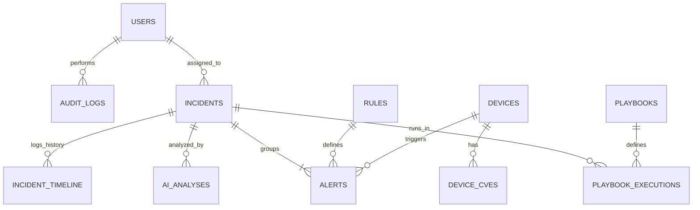

# Thiết Kế Cơ Sở Dữ Liệu Hệ Thống ICS-Guard

Tài liệu này đặc tả chi tiết cấu trúc cơ sở dữ liệu (Database Schema) cho backend của hệ thống **ICS-Guard**.
Hệ thống sử dụng mô hình cơ sở dữ liệu lai (Hybrid Database):
1. **MongoDB (Document-oriented DB)**: Lưu trữ các dữ liệu cấu hình, tài khoản người dùng, cấu trúc thiết bị, quy tắc bảo mật (Rules), các cảnh báo (Alerts), sự cố (Incidents), lịch sử tác động (Audit Logs) và phân tích AI.
2. **InfluxDB (Time-series DB)**: Lưu trữ dữ liệu telemetry chuỗi thời gian gửi lên từ các thiết bị IoT và lưu lượng truyền tải để tối ưu hiệu năng ghi đọc.

---

## 1. Sơ Đồ Thực Thể Liên Kết Tổng Quan (ERD)



---

## 2. Thiết Kế Các Collection Trong MongoDB

### 2.1. Collection: `users`
Lưu trữ thông tin tài khoản người dùng và thông tin bảo mật đăng nhập (Module 1).

*   **Tên Collection**: `users`
*   **Cấu trúc dữ liệu mẫu**:
```json
{
  "_id": {"$oid": "6493b8f1c8e1e83f0f4a8b01"},
  "username": "admin_soc",
  "password_hash": "$2b$12$K7v19S6L4f0gP8hA3jK9u.e8yU1k3M5n7P9q2r1s0t4u5v6w7x8y.", // bcrypt
  "email": "admin@icsguard.gov.vn",
  "full_name": "Nguyễn Văn Trực",
  "role": "admin", // admin | analyst | viewer
  "is_active": true,
  "login_failures": {
    "count": 0,
    "last_failed_at": null,
    "lockout_until": null // Khóa tài khoản sau 5 lần đăng nhập sai liên tiếp
  },
  "created_at": {"$date": "2026-06-01T08:00:00Z"},
  "updated_at": {"$date": "2026-06-15T09:30:00Z"}
}
```
*   **Đặc tả chi tiết các trường**:
    | Tên trường | Kiểu dữ liệu | Ràng buộc | Mô tả |
    | :--- | :--- | :--- | :--- |
    | `_id` | ObjectId | Primary Key | Khóa chính tự sinh |
    | `username` | String | Unique, Index | Tên đăng nhập hệ thống |
    | `password_hash` | String | Required | Mật khẩu băm bằng bcrypt |
    | `email` | String | Unique, Required | Email liên hệ của nhân viên |
    | `full_name` | String | Required | Họ và tên hiển thị |
    | `role` | String | enum | Quyền hạn: `admin`, `analyst`, `viewer` |
    | `is_active` | Boolean | Default: `true` | Trạng thái kích hoạt tài khoản |
    | `login_failures` | Document | Required | Theo dõi chống brute force đăng nhập |
    | `created_at`/`updated_at`| Date | Required | Thời gian khởi tạo và cập nhật |

---

### 2.2. Collection: `devices`
Lưu trữ thông tin cấu hình, thông số cơ bản và trạng thái bảo mật của thiết bị IoT (Module 1 & Module 3).

*   **Tên Collection**: `devices`
*   **Cấu trúc dữ liệu mẫu**:
```json
{
  "_id": "plc-factory-01", // ID tường minh khớp với client_id trong MQTT
  "name": "PLC Điều Khiển Trạm Trộn Số 3",
  "type": "plc", // plc | smart_meter | sensor | camera
  "zone": "Zone A - Nhà máy số 3",
  "ip_address": "192.168.10.15",
  "mac_address": "00:1A:2B:3C:4D:5E",
  "status": "online", // online | offline | quarantined
  "risk_score": 75.5, // Tính điểm tự động dựa trên CVE và lịch sử Alert
  "api_key": "sec_key_e3b0c44298fc1c149afbf4c8996fb924", // Dành cho REST Ingestion Agent
  "baseline_metrics": {
    "bytes_per_second_max": 25000,
    "connection_rate_max": 20
  },
  "firmware_version": "v2.4.1",
  "hardware_model": "Siemens S7-1200",
  "created_at": {"$date": "2026-06-01T08:00:00Z"},
  "updated_at": {"$date": "2026-06-21T09:15:00Z"}
}
```
*   **Đặc tả chi tiết các trường**:
    | Tên trường | Kiểu dữ liệu | Ràng buộc | Mô tả |
    | :--- | :--- | :--- | :--- |
    | `_id` | String | Primary Key | ID thiết bị (duy nhất, dùng để map MQTT Client) |
    | `name` | String | Required | Tên hiển thị thiết bị |
    | `type` | String | enum | Phân loại thiết bị (`plc`, `smart_meter`, `sensor`, `camera`) |
    | `zone` | String | Index | Phân vùng mạng của thiết bị |
    | `ip_address` | String | Index | Địa chỉ IPv4 của thiết bị |
    | `mac_address` | String | Unique | Địa chỉ MAC vật lý |
    | `status` | String | enum | Trạng thái: `online`, `offline`, `quarantined` |
    | `risk_score` | Float | Min: 0, Max: 100 | Điểm rủi ro tổng hợp |
    | `api_key` | String | Unique, Index | Khóa bí mật dùng xác thực khi gửi REST log |
    | `baseline_metrics` | Document | Required | Ngưỡng đo lường tiêu chuẩn của thiết bị |

---

### 2.3. Collection: `device_cves`
Lưu thông tin lỗ hổng bảo mật (CVE) ánh xạ cho từng thiết bị để phục vụ tính điểm rủi ro (Module 3 - CVE Correlator).

*   **Tên Collection**: `device_cves`
*   **Cấu trúc dữ liệu mẫu**:
```json
{
  "_id": {"$oid": "6493b8f1c8e1e83f0f4a8b05"},
  "device_id": "plc-factory-01",
  "cve_id": "CVE-2022-38773",
  "cvss_score": 8.8,
  "description": "Lỗ hổng tràn bộ đệm trên thiết bị Siemens S7 cho phép thực thi mã từ xa.",
  "severity": "HIGH", // LOW | MEDIUM | HIGH | CRITICAL
  "status": "vulnerable", // vulnerable | patched | ignored
  "detected_at": {"$date": "2026-06-08T09:00:00Z"},
  "patched_at": null
}
```
*   **Đặc tả chi tiết các trường**:
    | Tên trường | Kiểu dữ liệu | Ràng buộc | Mô tả |
    | :--- | :--- | :--- | :--- |
    | `_id` | ObjectId | Primary Key | Khóa tự sinh |
    | `device_id` | String | ForeignKey, Index | Liên kết sang `devices._id` |
    | `cve_id` | String | Required, Index | Mã định danh CVE (NVD Database) |
    | `cvss_score` | Float | Min: 0, Max: 10 | Điểm nghiêm trọng theo CVSS v3 |
    | `severity` | String | enum | Phân cấp độ nghiêm trọng dựa trên điểm |
    | `status` | String | enum | Trạng thái vá lỗi (`vulnerable`, `patched`, `ignored`) |

---

### 2.4. Collection: `rules`
Cấu hình các quy tắc nghiệp vụ giúp phát hiện sự kiện mạng bất thường (Module 4 - Rule Builder).

*   **Tên Collection**: `rules`
*   **Cấu trúc dữ liệu mẫu**:
```json
{
  "_id": {"$oid": "6493b8f1c8e1e83f0f4a8b10"},
  "rule_name": "DEVICE_BRUTE_FORCE",
  "description": "Phát hiện hành vi brute force đăng nhập thiết bị IoT",
  "is_active": true,
  "severity": "CRITICAL", // INFO | MEDIUM | HIGH | CRITICAL
  "conditions": [
    {
      "field": "event_type",
      "operator": "equals",
      "value": "AUTH_FAILED"
    }
  ],
  "time_window_seconds": 120, // 2 phút
  "trigger_count": 10, // 10 lần vi phạm trong 2 phút
  "group_by": ["device_id", "source_ip"],
  "actions": [
    {
      "action_type": "email",
      "config": {
        "template": "alert_default_email",
        "recipients": ["soc-alerts@icsguard.gov.vn"]
      }
    },
    {
      "action_type": "telegram",
      "config": {
        "channel_id": "@ics_guard_alerts"
      }
    },
    {
      "action_type": "block_ip",
      "config": {
        "duration_seconds": 86400 // Chặn IP 24 giờ
      }
    },
    {
      "action_type": "isolate_device",
      "config": {}
    }
  ],
  "created_by": {"$oid": "6493b8f1c8e1e83f0f4a8b01"}, // references users
  "created_at": {"$date": "2026-06-05T10:00:00Z"},
  "updated_at": {"$date": "2026-06-18T14:20:00Z"}
}
```

---

### 2.5. Collection: `alerts`
Lưu trữ các cảnh báo bảo mật được kích hoạt từ Rule Engine hoặc Mô hình AI/ML Anomaly Detector (Module 3 & Module 4).

*   **Tên Collection**: `alerts`
*   **Cấu trúc dữ liệu mẫu**:
```json
{
  "_id": {"$oid": "6493b8f1c8e1e83f0f4a8b20"},
  "rule_name": "DEVICE_BRUTE_FORCE", // null nếu là Anomaly từ AI/ML
  "device_id": "plc-factory-01",
  "title": "SSH Brute Force Detected",
  "description": "Thiết bị nhận liên tiếp 15 bản tin xác thực lỗi trong vòng 1 phút.",
  "severity": "CRITICAL", // INFO | MEDIUM | HIGH | CRITICAL
  "status": "new", // new | acknowledged | resolved | false_positive
  "source_ip": "185.220.101.45",
  "destination_ip": "192.168.10.15",
  "event_count": 15,
  "raw_events_sample": [
    {
      "timestamp": "2026-06-08T09:15:00Z",
      "message": "Failed password for root from 185.220.101.45 port 49283 ssh2"
    }
  ],
  "detected_at": {"$date": "2026-06-08T09:15:33Z"},
  "resolved_at": null,
  "resolved_by": null,
  "incident_id": {"$oid": "6493b8f1c8e1e83f0f4a8b30"} // null nếu chưa được gán vào incident
}
```
*   **Đặc tả chi tiết các trường**:
    | Tên trường | Kiểu dữ liệu | Ràng buộc | Mô tả |
    | :--- | :--- | :--- | :--- |
    | `_id` | ObjectId | Primary Key | Khóa tự sinh |
    | `rule_name` | String | ForeignKey, Index | Quy tắc kích hoạt cảnh báo này |
    | `device_id` | String | ForeignKey, Index | Thiết bị xảy ra cảnh báo |
    | `title` | String | Required | Tiêu đề cảnh báo ngắn gọn |
    | `description` | String | Required | Chi tiết hành vi vi phạm |
    | `severity` | String | enum, Index | Mức độ nguy cấp của cảnh báo |
    | `status` | String | enum, Index | Trạng thái xử lý (`new`, `acknowledged`, ...) |
    | `source_ip` | String | Index | IP của kẻ tấn công (nếu có) |
    | `detected_at` | Date | Index | Thời điểm phát hiện cảnh báo |

---

### 2.6. Collection: `incidents`
Quản lý các sự cố bảo mật (nhóm một hoặc nhiều Alert có liên quan) để điều phối xử lý trong SOC (Module 5 & Module 6).

*   **Tên Collection**: `incidents`
*   **Cấu trúc dữ liệu mẫu**:
```json
{
  "_id": {"$oid": "6493b8f1c8e1e83f0f4a8b30"},
  "title": "Sự cố tấn công Brute Force & Xâm nhập plc-factory-01",
  "description": "Phát hiện brute force liên tục và có dấu hiệu lưu lượng tăng vọt sau đó.",
  "status": "investigating", // open | investigating | remediated | closed
  "severity": "CRITICAL", // LOW | MEDIUM | HIGH | CRITICAL
  "assigned_to": {"$oid": "6493b8f1c8e1e83f0f4a8b01"}, // Analyst thụ lý
  "alert_ids": [
    {"$oid": "6493b8f1c8e1e83f0f4a8b20"}
  ],
  "created_at": {"$date": "2026-06-08T09:16:00Z"},
  "updated_at": {"$date": "2026-06-08T09:20:00Z"},
  "closed_at": null
}
```

---

### 2.7. Collection: `incident_timeline`
Lưu dòng sự kiện chi tiết của một Incident, hiển thị trên giao diện SOC Dashboard (Module 5 - Incident Timeline).

*   **Tên Collection**: `incident_timeline`
*   **Cấu trúc dữ liệu mẫu**:
```json
{
  "_id": {"$oid": "6493b8f1c8e1e83f0f4a8b40"},
  "incident_id": {"$oid": "6493b8f1c8e1e83f0f4a8b30"},
  "event_time": {"$date": "2026-06-08T09:15:33Z"},
  "actor": "System Rule Engine", // AI Assistant | System Rule Engine | Tên Analyst
  "action_type": "auto_response", // incident_created | auto_response | ai_analysis | status_change | manual_note
  "description": "Hệ thống tự động thực thi block IP 185.220.101.45 và cách ly thiết bị plc-factory-01.",
  "metadata": {
    "blocked_ip": "185.220.101.45",
    "isolated_device": "plc-factory-01",
    "firewall_status": "blocked_successfully"
  }
}
```

---

### 2.8. Collection: `playbooks`
Lưu cấu hình các bước kịch bản tự động phản ứng khi có tấn công xảy ra (Module 4 - Playbook Engine).

*   **Tên Collection**: `playbooks`
*   **Cấu trúc dữ liệu mẫu**:
```json
{
  "_id": {"$oid": "6493b8f1c8e1e83f0f4a8b50"},
  "name": "Kịch bản Xử lý Tấn công Xâm nhập Nghiêm trọng",
  "description": "Cách ly thiết bị, block IP nguồn và bắn tin khẩn cấp Telegram",
  "is_active": true,
  "steps": [
    {
      "step_number": 1,
      "action_type": "block_ip",
      "parameters": { "duration": 86400 }
    },
    {
      "step_number": 2,
      "action_type": "isolate_device",
      "parameters": { "reason": "Compromised by Critical Alert" }
    },
    {
      "step_number": 3,
      "action_type": "send_telegram",
      "parameters": { "urgency": "immediate" }
    }
  ],
  "created_at": {"$date": "2026-06-01T08:00:00Z"},
  "updated_at": {"$date": "2026-06-01T08:00:00Z"}
}
```

---

### 2.9. Collection: `ai_analyses`
Lưu phân tích của Trợ lý AI về sự cố bảo mật, giải thích log tự nhiên và ánh xạ MITRE ATT&CK (Module 7).

*   **Tên Collection**: `ai_analyses`
*   **Cấu trúc dữ liệu mẫu**:
```json
{
  "_id": {"$oid": "6493b8f1c8e1e83f0f4a8b60"},
  "incident_id": {"$oid": "6493b8f1c8e1e83f0f4a8b30"},
  "log_summary": "Phát hiện hoạt động thử đăng nhập trái phép nhiều lần vào cổng dịch vụ của PLC sử dụng tài khoản có đặc quyền cao (root) từ một địa chỉ IP thuộc mạng ẩn danh TOR.",
  "attack_reasoning": "Kẻ tấn công sử dụng kỹ thuật Brute Force để cố gắng dò quét thông tin xác thực. Việc tiếp diễn nhiều lần thất bại trong thời gian ngắn cho thấy công cụ dò quét tự động đang được sử dụng. Nếu thành công, kẻ tấn công có thể kiểm soát hoàn toàn PLC, thay đổi logic hoạt động và phá hoại hệ thống.",
  "mitre_attack_mappings": [
    {
      "tactic": "Credential Access",
      "technique_id": "T1110",
      "technique_name": "Brute Force"
    },
    {
      "tactic": "Initial Access",
      "technique_id": "T1190",
      "technique_name": "Exploit Public-Facing Application"
    }
  ],
  "remediation_advice": [
    {
      "step": "Xác nhận và duy trì việc chặn IP 185.220.101.45 tại Router Biên.",
      "priority": "HIGH"
    },
    {
      "step": "Thay đổi toàn bộ mật khẩu tài khoản truy cập trên plc-factory-01.",
      "priority": "HIGH"
    },
    {
      "step": "Tắt dịch vụ SSH không mã hóa/không bảo mật trên phân vùng sản xuất nếu không sử dụng.",
      "priority": "MEDIUM"
    }
  ],
  "model_used": "deepseek-r1",
  "generated_at": {"$date": "2026-06-08T09:17:15Z"}
}
```

---

### 2.10. Collection: `audit_logs`
Lưu vết mọi hoạt động cấu trị và thay đổi hệ thống của các quản trị viên/analyst để đáp ứng kiểm toán (Module 1).

*   **Tên Collection**: `audit_logs`
*   **Cấu trúc dữ liệu mẫu**:
```json
{
  "_id": {"$oid": "6493b8f1c8e1e83f0f4a8b70"},
  "user_id": {"$oid": "6493b8f1c8e1e83f0f4a8b01"},
  "username": "admin_soc",
  "action": "MODIFY_RULE",
  "target_resource": "rules:DEVICE_BRUTE_FORCE",
  "details": {
    "before": { "time_window_seconds": 60 },
    "after": { "time_window_seconds": 120 }
  },
  "ip_address": "192.168.1.100",
  "user_agent": "Mozilla/5.0 (Windows NT 10.0; Win64; x64) Chrome/120.0.0.0",
  "status": "SUCCESS",
  "timestamp": {"$date": "2026-06-18T14:20:00Z"}
}
```

---

## 3. Thiết Kế Cơ Sở Dữ Liệu Thời Gian InfluxDB (Time-series)

Dữ liệu telemetry và lưu lượng mạng được lưu trữ trong InfluxDB phiên bản 1.8. 
Các tag đóng vai trò làm các index để lọc nhanh trên Dashboard.

### 3.1. Measurement: `iot_telemetry`
Lưu trữ định kỳ các thông số hoạt động vật lý của thiết bị IoT (nhiệt độ, áp suất, CPU, RAM) phục vụ vẽ biểu đồ giám sát và phát hiện bất thường của thiết bị.

*   **Tags (Indexed)**:
    *   `device_id`: Khớp với `devices._id` trong MongoDB (Ví dụ: `plc-factory-01`)
    *   `device_type`: Loại thiết bị (`plc`, `sensor`, `smart_meter`)
    *   `zone`: Phân vùng thiết bị (`Zone-A`, `Zone-B`)
*   **Fields (Metrics)**:
    *   `cpu_usage`: Float (Phần trăm sử dụng CPU, ví dụ: `42.5`)
    *   `memory_usage`: Float (Phần trăm sử dụng RAM, ví dụ: `51.2`)
    *   `temperature`: Float (Nhiệt độ đo được, ví dụ: `38.6`)
    *   `pressure`: Float (Áp suất đo được nếu có, ví dụ: `1.2`)
    *   `status`: Integer (`1`: Bình thường, `0`: Lỗi kỹ thuật)
*   **Timestamp**: Nano/Millisecond Epoch (Tự động lưu khi nhận dữ liệu)

---

### 3.2. Measurement: `network_traffic`
Lưu trữ các thông số lưu lượng cổng mạng phục vụ việc phân tích đột biến lưu lượng (Traffic Spike - Module 2 & 3).

*   **Tags (Indexed)**:
    *   `device_id`: Khớp với `devices._id` trong MongoDB
    *   `zone`: Phân vùng thiết bị
    *   `protocol`: Giao thức mạng truyền tải (`mqtt`, `rest_api`, `ssh`)
*   **Fields (Metrics)**:
    *   `bytes_per_second`: Float (Băng thông mạng tức thời, ví dụ: `185420.0`)
    *   `packets_per_second`: Float (Mật độ gói tin, ví dụ: `120.0`)
    *   `connections_count`: Integer (Số kết nối đồng thời, ví dụ: `5`)
*   **Timestamp**: Nano/Millisecond Epoch

---

### 3.3. Chính sách lưu giữ dữ liệu (Retention Policy - RP)
*   **Tên chính sách**: `two_weeks_telemetry`
*   **Mô tả**: Để tối ưu dung lượng đĩa cứng của InfluxDB, dữ liệu thô (raw telemetry) từ IoT sẽ tự động được dọn dẹp sau **14 ngày (2 tuần)**. 
*   **Chi tiết cấu hình**:
    ```sql
    CREATE RETENTION POLICY "two_weeks_telemetry" ON "ics_guard_db" DURATION 14d REPLICATION 1 DEFAULT
    ```

---

## 4. Các Index Cần Thiết Để Tối Ưu Hiệu Năng (MongoDB)

Để đảm bảo dashboard tải dưới 2 giây và xử lý pipeline dưới 500ms, cần đánh các chỉ mục (Indexes) sau trong MongoDB:

1.  **Collection `users`**:
    *   `{ "username": 1 }` (Unique) - Xác thực đăng nhập nhanh.
    *   `{ "email": 1 }` (Unique) - Đảm bảo tính duy nhất.
2.  **Collection `devices`**:
    *   `{ "status": 1 }` - Đếm nhanh thiết bị Online/Offline phục vụ KPI Cards.
    *   `{ "zone": 1 }` - Phục vụ tải bản đồ topo phân vùng.
3.  **Collection `alerts`**:
    *   `{ "detected_at": -1 }` - Sắp xếp bảng Alert Feed từ mới đến cũ.
    *   `{ "status": 1, "severity": 1 }` - Phục vụ bộ lọc nhanh trên Dashboard.
    *   `{ "device_id": 1, "detected_at": -1 }` - Tìm nhanh alert theo thiết bị.
4.  **Collection `incidents`**:
    *   `{ "status": 1 }` - Liệt kê nhanh danh sách sự cố chưa xử lý.
    *   `{ "created_at": -1 }` - Vẽ dòng thời gian sự cố (Incident Timeline).
5.  **Collection `audit_logs`**:
    *   `{ "timestamp": -1 }` - Sắp xếp nhật ký hoạt động.
    *   `{ "user_id": 1 }` - Truy vấn hoạt động của một tài khoản nhất định.
