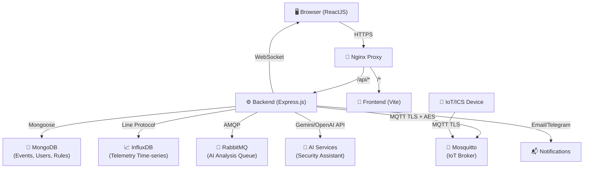

# ICS-Guard: Industrial Cyber Security System

## 1. Giới thiệu

ICS-Guard là hệ thống giám sát an toàn mạng cho IoT/ICS, gồm các thành phần:

- **Frontend**: ReactJS (Vite) Dashboard
- **Backend**: Node.js + Express.js API
- **AI Services**: Node.js module (Gemini / OpenAI)
- **Database**: MongoDB, InfluxDB
- **Message Broker**: RabbitMQ, MQTT (Mosquitto)
- **Proxy**: Nginx
- **Deployment**: Docker Compose

## 2. Kiến trúc hệ thống



## 3. Cài đặt môi trường

| Phần mềm | Phiên bản | Tải về |
| :--- | :--- | :--- |
| **Docker Desktop** | Mới nhất | [Tại đây](https://www.docker.com/products/docker-desktop/) |
| **Git** | Mới nhất | [Tại đây](https://git-scm.com/downloads) |
| **Node.js** | 20 LTS+ | [Tại đây](https://nodejs.org/) |
| **MongoDB Compass** (Tùy chọn) | Mới nhất | [Tại đây](https://www.mongodb.com/products/tools/compass) |

## 4. Cấu hình môi trường

Tạo file `.env` từ file mẫu:

**Windows**
```cmd
copy .env.example .env
```

Mở file `.env` và điền các giá trị thực tế. **Không commit file `.env` lên git.**

> **⚠️ Lưu ý bảo mật:**
> - `JWT_SECRET` phải là chuỗi ngẫu nhiên mạnh (>= 32 ký tự)
> - `AES_SECRET_KEY` phải là chuỗi hex 32 ký tự
> - Thay đổi toàn bộ mật khẩu mặc định trước khi deploy production

## 5. Chạy dự án

```bash
docker compose up -d --build
```

Docker sẽ tự động:
- Build Backend và Frontend
- Cài `node_modules` cho Frontend và Backend
- Khởi tạo MongoDB, RabbitMQ, Mosquitto và InfluxDB
- Hot-reload code khi có thay đổi

## 6. Kiểm tra

```bash
docker ps
```

Các container cần chạy: `frontend`, `backend`, `mongodb`, `rabbitmq`, `mosquitto`, `influxdb`, `nginx`.

## 7. Truy cập

| Dịch vụ | Địa chỉ |
| :--- | :--- |
| **Frontend** | [http://localhost:3000](http://localhost:3000) |
| **Backend API** | [http://localhost:8000](http://localhost:8000) |
| **Swagger** | [http://localhost:8000/docs](http://localhost:8000/docs) |
| **RabbitMQ** | [http://localhost:15672](http://localhost:15672) |
| **MongoDB** | `localhost:27017` |

### MongoDB Compass

Kết nối MongoDB Compass bằng connection string trong file `.env` của bạn (key `MONGO_URI`).

> **⚠️ Không hardcode credentials.** Xem `.env.example` để biết cấu trúc URI.

